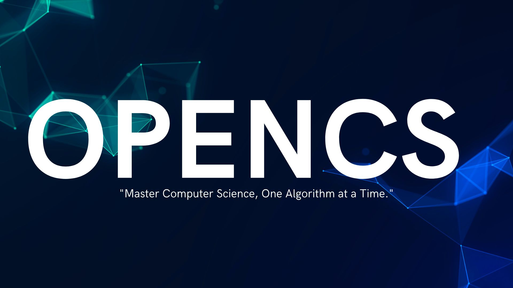

<h1 align="center">OpenCS: Empowering the next generation of computer scientists, open to all, free for all.</h1>

  

  

 OpenCS is a comprehensive, open-source Computer Science curriculum designed for individuals seeking a deep, well-rounded understanding of fundamental computing concepts. 

  <a href="[Link to  website]">Go to Website ✨</a> ·
  <a href="[Link to bug reporting system (e.g., GitHub Issues)]">Report a Bug 🐞</a> ·
  <a href="[Link to contribution guidelines]">Contribute 🫶</a> ·
  <a href="[Link to curriculum overview/page]">Curriculum 🎓</a>

---

## About OpenCS

OpenCS is a comprehensive, open-source Computer Science curriculum designed for individuals seeking a deep, well-rounded understanding of fundamental computing concepts. It is ideal for learners who are self-motivated, disciplined, and committed to pursuing a rigorous CS education independently, supported by a global community of fellow learners.  It is *not* simply career training or professional development, but a true academic pursuit.

This curriculum mirrors the degree requirements of an undergraduate computer science major, excluding general education (non-CS) courses, as it is tailored for individuals who may already have education outside of CS. The courses included are world-class, sourced from institutions like Harvard, Princeton, MIT, and Stanford, and carefully selected based on:

*   ✅ **Academic Rigor:** Ensuring a strong theoretical and practical foundation.
*   ✅ **Comprehensive Coverage:** Covering core CS concepts, specializations, and real-world applications.
*   ✅ **Accessibility:** Openly available, high-quality learning resources.

Upon completion of OpenCS, learners will possess knowledge and expertise equivalent to a full bachelor's degree in Computer Science, preparing them for industry roles, freelance work, research, and advanced studies.

🚀 Inspired by [OSSU (Open Source Society University)](https://github.com/ossu) in [CS](https://github.com/ossu/computer-science) and [Mathematics](https://github.com/ossu/math), OpenCS follows a structured, progressive, and mastery-based approach, making world-class CS education accessible to all, for free.

## Contributing to OpenCS

OpenCS is a Active Project of NovaVerseOrg, and we welcome contributions of all kinds! From documentation and UI/UX design to curriculum development, infrastructure improvements, and bug reports, every contribution is valued. Interested in contributing? Read our [Governance Model]() and explore the various ways you can [Get Involved]() with NovaVerseOrg!

# Contents

- [About OpenCS](#about-opencs)  
- [Goals of OpenCS](#goals-of-opencs)
- [Key Features of OpenCS](#key-features-of-opencs)
- [How to Use OpenCS](#how-to-use-opencs)
- [Who is OpenCS For?](#who-is-opencs-for)
- [Why OpenCS?](#why-opencs)
- [Curriculum](#curriculum) 
- [Prerequisites](#prerequisites) 

## Goals of OpenCS

*   ✔ **Guide Learners:** Provide a clear, structured roadmap for self-learners who are confused about where to start.
*   ✔ **Curate High-Quality Resources:** Share only the most valuable, tested, and effective learning materials.
*   ✔ **Build Expertise:** Equip learners with knowledge and skills equivalent to a full bachelor's degree in Computer Science.

## Key Features of OpenCS

*   ✅ **Dynamic Learning:** Resources are continuously added and updated based on their effectiveness and relevance.
*   ✅ **Comprehensive Coverage:** The curriculum is structured to match or exceed the depth of a university-level CS degree.
*   ✅ **Resources:** Includes free, open-source, and premium courses (if essential), all of which have significantly contributed to building expertise.
*   ✅ **Project-Based Mastery:** Encourages hands-on learning through real-world projects, problem-solving exercises, and research-driven applications.

## How to Use OpenCS

*    **Follow the Curriculum:** Start from the fundamentals and progressively move through intermediate and advanced topics.
*    **Leverage the Resources:** Utilize carefully curated materials and detailed notes to accelerate your learning.
*    **Work on Projects:** Apply theoretical knowledge to real-world scenarios, solidifying understanding and building a strong portfolio.
*   **Engage with the Community:** Connect with other learners, contribute to open-source projects, and participate in discussions.

## Who is OpenCS For?

* **Self-Taught Learners:** Anyone seeking a structured and in-depth roadmap to master CS from scratch.
*   **Aspiring Researchers:** Individuals aiming to specialize in AI, Quantum Computing, Cryptography, or Theoretical CS.
*   **Tech Professionals:** Developers looking to deepen their expertise or transition into advanced CS fields.
*   **University Students:** Those who want to supplement their degree with additional structured learning.

## Why OpenCS?

OpenCS is more than just a curriculum—it’s a testament to the power of self-learning and open-source collaboration. By following this roadmap, learners can gain the equivalent knowledge of a full bachelor's degree in Computer Science, develop real-world expertise, and become industry-ready.

*   💰 **Cost:** Nearly all course materials are available for free. Some platforms (e.g., Coursera, edX) may charge for graded assignments, certifications, or exams, but financial aid options are available.

# Curriculum

**Curriculum version:** `1.0.0`

- [Prerequisites](./Prerequisites/README.md) 
 - [Phase 1: Foundations (Core CS)](#phase-1-foundations-core-cs) 
 - [Phase 2: Specialization Exploration]() 
 - [Phase 3: Focused Specialization (Deep Specialization)]() 
 - [Phase 4: Mastery (Capstone/Research/Portfolio)]() 
 ---

# Phase 1: Foundations (Core CS)

This Phase covers the essential knowledge and skills that all computer science graduates should possess. It's designed to provide a strong foundation in programming, algorithms, data structures, computer systems, and other core CS concepts.

| CS Core Field | Core Topics Covered | Module Link |
|---|---|---|
| **Programming Fundamentals** | Python, C++, Object-Oriented Programming, Software Engineering Principles | [Module 1: Programming Fundamentals](./Foundations/Module_1.md#module-1-programming-fundamentals) |
| **Mathematical Foundations** | Discrete Mathematics, Probability, Statistics, Linear Algebra | [Module 2: Mathematical Foundations](./Foundations/Module_2.md#module-2-mathematical-foundations) |
| **Foundational Systems** | Computer Architecture, Operating Systems, Computer Networking | [Module 3: Foundational Systems](./Foundations/Module_3.md#module-3-foundational-systems) |
| **Foundational Applications** | Databases, Machine Learning, Computer Graphics, Software Engineering | [Module 4: Foundational Applications](./Foundations/Module_4.md#module-4-foundational-applications) |
| **Fundamental Theory and Ethics** | Algorithms, Computational Complexity, Ethics, Intellectual Property, Data Privacy | [Module 5: Fundamental Theory and Ethics](./Foundations/Module_5.md#module-5-fundamental-theory-and-ethics) |

✅ **Every student must complete the CS Core before moving to Phase 2: Specialization Exploration.**